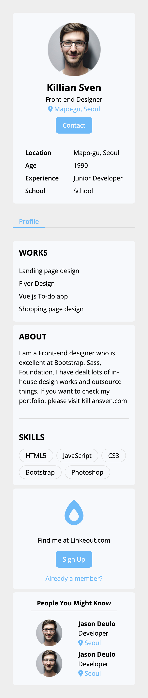
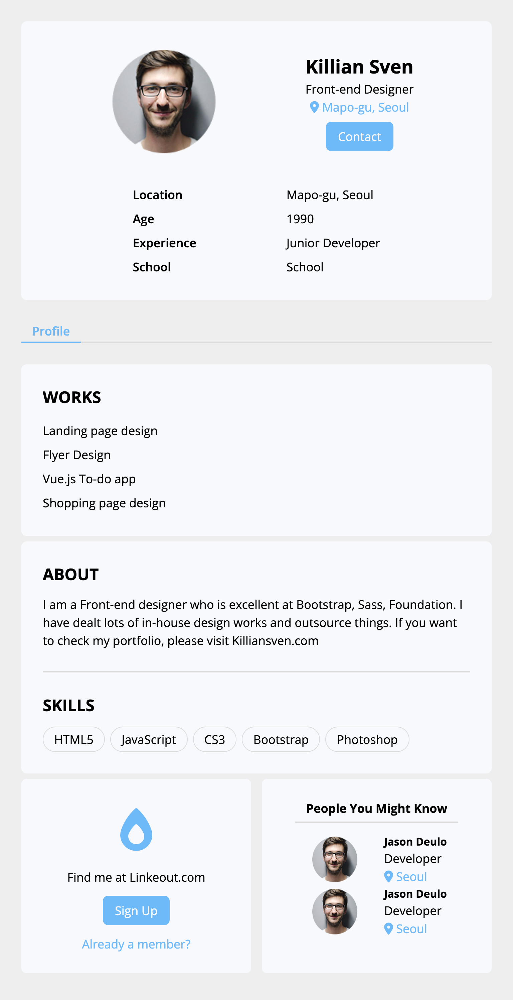
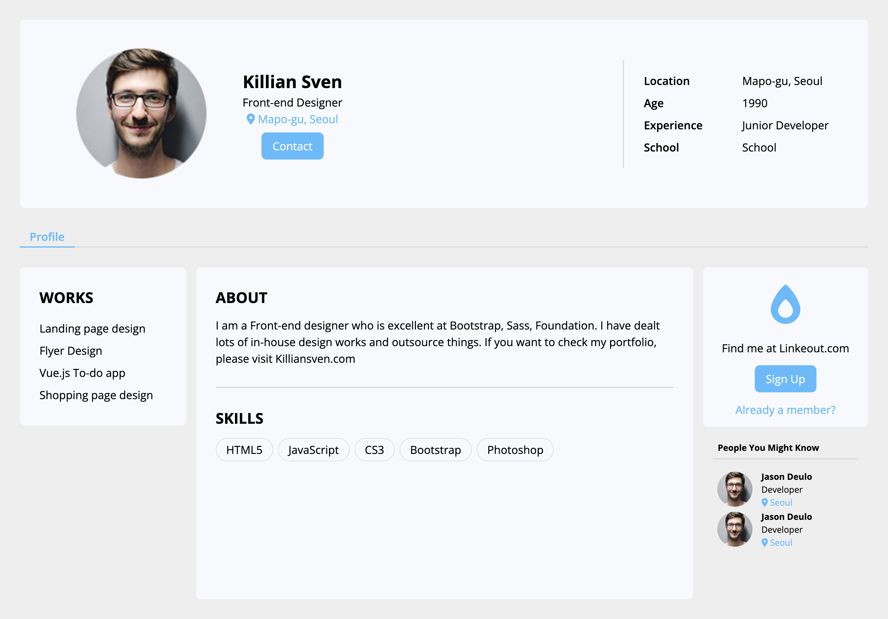

## Overview

This is a static **SNS Profile Page** built with **HTML** and **CSS**.  
It displays a professional profile with sections for personal details, work history, skills, and connection suggestions—similar to a lightweight social profile card.

The goal of this project is to practice clean HTML/CSS structure, responsive design with media queries, and consistent UI styling.

### Screenshot

#### Mobile

#### Tablet

#### Desktop

## My Progress

### Built with

- Semantic **HTML5**
- Modern **CSS3** (Flexbox, Responsive Media Queries, CSS Variables)
- **Google Fonts** (Open Sans)
- **FontAwesome** icons

### What I Learned

- Structuring a profile layout with **flexbox** and **responsive media queries**.
- Using **CSS custom properties** for color management.
- Applying **hover effects** and active states for interactive elements like buttons and links.
- Organising reusable UI blocks with `section-box` and consistent class naming (BEM-style).
- Designing **mobile first layout** then expanding styles to **tablet** and **desktop screen**.

### Continued Development

- **Deployment:** Plan to deploy on **GitHub Pages** (or Netlify).
- **Code Cleanup:** Refactor HTML and CSS for more semantic tags and cleaner structure.
- **Accessibility:** Add ARIA labels and improve screen reader support.
